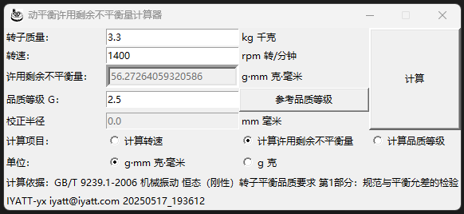

# permissible-residual-unbalance-calculator 动平衡许用剩余不平衡量计算器

功能：  
* 计算许用剩余不平衡量：需要提供转子质量、转速、品质等级；
* 计算转速：需要提供转子质量、许用剩余不平衡量、品质等级；
* 计算品质等级：需要提供转子质量、转速、许用剩余不平衡量。  

注意：不平衡量默认单位为 g·mm，如果使用单位 g，则必须填写校正半径计算。

## 测试环境

Python 3.13.1

这里只提供了 Windows 版，只支持 Windows 8 及以上。